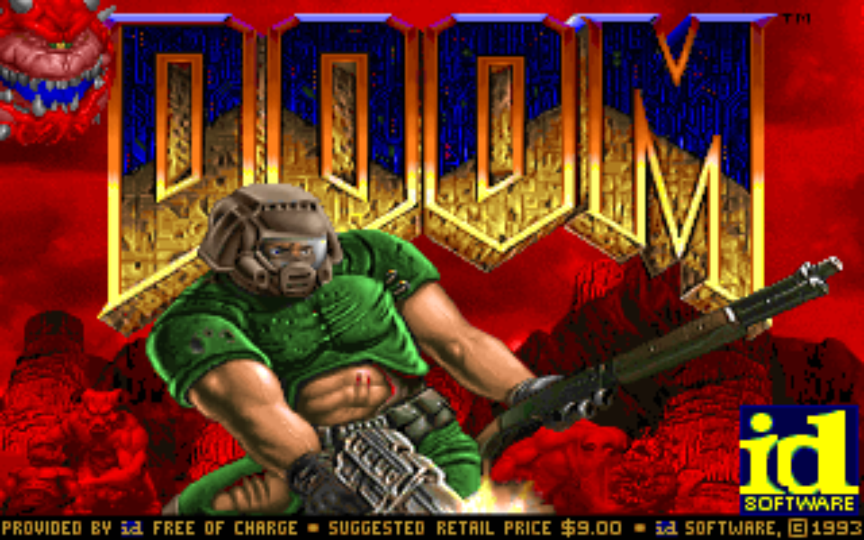

# DOOM

This is another port of the [original DOOM source code](https://github.com/id-Software/DOOM) built with [SDL](https://www.libsdl.org/), targeting Linux, BSD and [WASM](https://en.wikipedia.org/wiki/WebAssembly) with [Emscripten](https://emscripten.org/).



You can play Another World directly in your browser by clicking [here](https://www.emaxilde.net/assets/games/doom/doom.html).

## COMPILE AND RUN FOR LINUX

### Install the dependencies

In order to build the Linux port, you must install the build toolchain and the [SDL2](https://www.libsdl.org/) library.

Under Debian and derivatives (Ubuntu, Mint, ...):

```
apt-get install build-essential libsdl2-dev libsdl2-image-dev libsdl2-mixer-dev
```

### Build the project

```
make -f Makefile.linux
```

or

```
./build.sh linux
```

### Install the data files

The original game data files must be copied into the [share/doom](share/doom) directory.

### Run the project

```
./bin/doom.bin
```

## COMPILE AND RUN FOR WASM

### Install the dependencies

In order to build the WASM port, You must install the [Emscripten](https://emscripten.org/) toolchain.

  - [Download and install](https://emscripten.org/docs/getting_started/downloads.html)

### Build the project

```
make -f Makefile.wasm
```

or

```
./build.sh wasm
```

### Install the data files

The original game data files must be copied into the [share/doom](share/doom) directory.

### Run the project

```
emrun ./bin/doom.html
```

## COMMAND-LINE OPTIONS

### Verbose level

  - `-quiet` set the verbose level to `0` (silent mode)
  - `-error` set the verbose level to `1`
  - `-alert` set the verbose level to `2`
  - `-print` set the verbose level to `3` (default)
  - `-debug` set the verbose level to `4`
  - `-trace` set the verbose level to `5`

### Scale factor

  - `-1` set scale factor to `1.0`, resolution of `320x200`
  - `-2` set scale factor to `1.5`, resolution of `480x300`
  - `-3` set scale factor to `2.0`, resolution of `640x400`
  - `-4` set scale factor to `2.5`, resolution of `800x500`
  - `-5` set scale factor to `3.0`, resolution of `960x600` (default)
  - `-6` set scale factor to `3.5`, resolution of `1120x700`
  - `-7` set scale factor to `4.0`, resolution of `1280x800`
  - `-8` set scale factor to `4.5`, resolution of `1440x900`
  - `-9` set scale factor to `5.0`, resolution of `1600x1000`

### Scale mode

  - `-nearest` set scale mode to `nearest pixel`
  - `-linear` set scale mode to `linear filtering`
  - `-best` set scale mode to `anisotropic filtering` (default)

## LICENSE

As published by John John Carmack on 1997-12-23, the source code is released under the terms of the GNU General Public License 2.0.

```
DOOM - Copyright (c) 1993-1996 - id Software, Inc

This program is free software: you can redistribute it and/or modify
it under the terms of the GNU General Public License as published by
the Free Software Foundation, either version 2 of the License, or
(at your option) any later version.

This program is distributed in the hope that it will be useful,
but WITHOUT ANY WARRANTY; without even the implied warranty of
MERCHANTABILITY or FITNESS FOR A PARTICULAR PURPOSE.  See the
GNU General Public License for more details.

You should have received a copy of the GNU General Public License
along with this program.  If not, see <http://www.gnu.org/licenses/>
```

## DISCLAIMER

The original game data files are protected under the copyrights of their authors and are not distributed with this project.

```
Please do not distribute the original data game files with this project.
```

